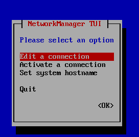
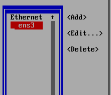
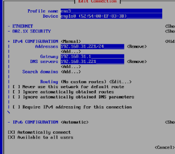
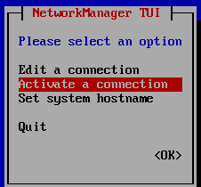
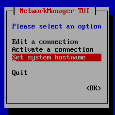
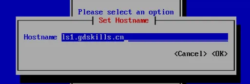

# 导航:  
> [做题准备](26%E7%9C%81%E8%B5%9Blinux%E5%8E%9F%E9%A2%98.md#做题准备)  --[视频]()    
> [NTP服务](26%E7%9C%81%E8%B5%9Blinux%E5%8E%9F%E9%A2%98.md#ntp服务)  --[视频]()_先做**DNS**服务和**SSH**服务再做该服务_ 1↩︎  
> [SSH服务](26%E7%9C%81%E8%B5%9Blinux%E5%8E%9F%E9%A2%98.md#ssh服务) --[视频]()_先做**DNS**服务,做的过程中生成公钥_    <--(The second!!!)  
> [DNS服务](26%E7%9C%81%E8%B5%9Blinux%E5%8E%9F%E9%A2%98.md#dns服务) --[视频]()   <-- (The first!!!)   
> [CA服务](26%E7%9C%81%E8%B5%9Blinux%E5%8E%9F%E9%A2%98.md#ca服务) --[视频]()  
> [ansible服务](26%E7%9C%81%E8%B5%9Blinux%E5%8E%9F%E9%A2%98.md#ansible服务) --[视频]() <-- 做了ssh密钥前提  
> [keepalived+tomcat+haproxy服务](26%E7%9C%81%E8%B5%9Blinux%E5%8E%9F%E9%A2%98.md#keepalived_tomcat_haproxy服务) --[视频]()    
> [samba服务](26%E7%9C%81%E8%B5%9Blinux%E5%8E%9F%E9%A2%98.md#samba服务) --[视频]()    
> [iscsi服务](26%E7%9C%81%E8%B5%9Blinux%E5%8E%9F%E9%A2%98.md#iscsi服务) --[视频]()    
> [postfix服务](26%E7%9C%81%E8%B5%9Blinux%E5%8E%9F%E9%A2%98.md#postfix服务)  
> [mariadb服务](26%E7%9C%81%E8%B5%9Blinux%E5%8E%9F%E9%A2%98.md#mariadb服务) --[视频]()    
> [dhcp服务](26%E7%9C%81%E8%B5%9Blinux%E5%8E%9F%E9%A2%98.md#dhcp服务)  
> [k8s服务](26%E7%9C%81%E8%B5%9Blinux%E5%8E%9F%E9%A2%98.md#k8s服务)  
> [audit脚本](26%E7%9C%81%E8%B5%9Blinux%E5%8E%9F%E9%A2%98.md#audit服务) --[视频]()    
>[开发服务](26%E7%9C%81%E8%B5%9Blinux%E5%8E%9F%E9%A2%98.md#开发服务)  
>[备份服务](26%E7%9C%81%E8%B5%9Blinux%E5%8E%9F%E9%A2%98.md#备份服务)  

---

# 做题准备:
[⬆️top⬆️](#导航)

**（一）检查实例环境**

1.网络管理信息表：

|   **网络名称**    | **协议版本** |    **子网网段**    |   **网关**    |          ipv4地址池          |
| :-----------: | :------: | :------------: | :---------: | :-----------------------: |
| **LinNetInt** | **IPv4** | 172.16.20.0/24 | 172.16.20.1 | 172.16.20.2-172.16.20.252 |


2.云主机信息表：

| **云主机** | **环境名称** |   **IPv4地址**   |   **完全合格域名**    |
| :-----: | :------: | :------------: | :-------------: |
| Rocky1  |  Rocky1  | LinNetInt：Auto | ls1.gdskills.cn |
| Rocky2  |  Rocky2  | LinNetInt：Auto | ls2.gdskills.cn |
| Rocky3  |  Rocky3  | LinNetInt：Auto | ls3.gdskills.cn |
| Rocky4  |  Rocky4  | LinNetInt：Auto | ls4.gdskills.cn |
| Kylin1  | KylinV10 | LinNetInt：Auto | ls5.gdskills.cn |
| Kylin2  | KylinV10 | LinNetInt：Auto | ls6.gdskills.cn |


本任务已提供操作系统镜像以及相关环境，所需软件安装包均在/root/目录下。涉及配置密码的步骤，除特殊说明外，密码均设置为Key-1122，创建完成云主机后，将所有实例从DHCP获取的地址改为静态地址。

**（二）DNS服务**

任务描述：创建dns服务器，实现企业域名访问。

## 1.配置所有rocky主机和kylin主机的IP地址和主机名称。  


先配置ip  
`nmtui`  
回车选择第一项  

回车选择网卡编辑  

配置完成
按下pagedown到OK
回车(保存)

esc退出到主菜单  
选择第二项  

回车两次刷新配置  

选择第三项设置系统名称  

回车确认  
//这里的主机名为ls1.gdskills.cn  

以上步骤都使用该方法配置其他的主机名与ip   
配置完ip后编辑本地仓库源    
`win + x  a`              //使用windows的ssh工具连接6台主机  

ssh: `ssh -p 22 root@192.168.31.221`  

**linux1-6:  **

`rm -rf  /etc/yum.repos.d/*.repo`    //删除默认的网络源  

**linux1:  **

`vi /etc/yum.repos.d/1.repo`      //编写本地仓的配置 -- vim使用语法移步到[vim](vim.md)  

```bash
[1]
name=1
enable=1
baseurl=file:///mnt/1/BaseOS
gpgcheck=0
[2]
name=2
enable=1
baseurl=file:///mnt/1/AppStream
gpgcheck=0
```
:wq      //退出保存  
`cat /etc/yum.repos.d/1.repo`      //把输出的结果选中后复制到linux2-6  

**linux2-6:  **

`vi /etc/yum.repos.d/1.repo`  

ctrl + v  

:wq  

**linux1-6:  **

`mkdir /mnt/1`  

`mount Rocky-9.2-x86_64-dvd.iso /mnt/1/`  

`dnf install bash* vim -y`  

`bash` //安装完bash补全包要重新进入终端  

---

## 2.所有Rocky(ls3-ls4除外)和Kylin(ls5除外)主机启用防火墙防火墙区域为public，在防火墙中放行对应服务端口。  

全部默认开启防火墙无需理会

---

# ntp服务
[⬆️top⬆️](#导航)

## 3.利用chrony，配置ls1为其他linux主机提供ntp服务。  

**<u>先做ssh 再做这个</u>**

## linux1:
[root@linux1 ~]#`vi /etc/chrony.conf`

```bash
# Use public servers from the pool.ntp.org project.
# Please consider joining the pool (https://www.pool.ntp.org/join.html).
#pool 2.rocky.pool.ntp.org iburst			#注释掉

# Use NTP servers from DHCP.
sourcedir /run/chrony-dhcp

# Record the rate at which the system clock gains/losses time.
driftfile /var/lib/chrony/drift

# Allow the system clock to be stepped in the first three updates
# if its offset is larger than 1 second.
makestep 1.0 3

# Enable kernel synchronization of the real-time clock (RTC).
rtcsync

# Enable hardware timestamping on all interfaces that support it.
#hwtimestamp *

# Increase the minimum number of selectable sources required to adjust
# the system clock.
#minsources 2

# Allow NTP client access from local network.
allow 192.168.31.0/24	#写所在的网段

# Serve time even if not synchronized to a time source.
local stratum 10		#取消注释
```

[root@ls1 ~]#`systemctl restart chronyd` //重启服务,应用配置

## linux2-9:  
`vi /etc/chrony.conf`  
```bash
3	 server 192.168.31.231 iburst
```

#### 发送chrony.conf到其余主机
`for i  in {3..9};do scp /etc/chrony.conf 192.168.31.23$i:/etc/ ;done`  

---

# ssh服务
[⬆️top⬆️](#导航)
## 4.所有linux主机root用户使用完全合格域名免密码ssh登录到其他linux主机。  

### linux1-9生成并发送ssh密钥：
```bash
ssh-keygen
ssh-copy-id **.**.**.**9              #密钥全部发送给一台主机，这台主机也要发给自己
scp .ssh/authorized_keys **.**.**.**:/root/.ssh/ #分发给各个主机
```
`vi /etc/ssh/sshd_config`    
```bash
42 PermitRootLogin yes
45 PubkeyAuthentication yes
#允许公钥登录
65 PasswordAuthenticaation  no
#允许密码登录
```

---
# dns服务
[⬆️top⬆️](#导航)
## 5.利用bind和bind-utils，配置ls1为主dns根服务器，区域文件为/var/named/named.root，ls2为备用dns服务器。为所有linux主机提供冗余dns正反向解析服务。正向区域文件均为/var/named/named.gdskills，反向区域文件均为/var/named/named.20。  

**linux1: **

`vi /etc/named.conf`  

```bash
options {
        listen-on port 53 { any; };
        listen-on-v6 port 53 { ::1; };
        directory       "/var/named";
        dump-file       "/var/named/data/cache_dump.db";
        statistics-file "/var/named/data/named_stats.txt";
        memstatistics-file "/var/named/data/named_mem_stats.txt";
        secroots-file   "/var/named/data/named.secroots";
        recursing-file  "/var/named/data/named.recursing";
        allow-query     { localhost; 192.168.200.0/24; };

        recursion yes;

        dnssec-validation no;

        managed-keys-directory "/var/named/dynamic";
        geoip-directory "/usr/share/GeoIP";

        pid-file "/run/named/named.pid";
        session-keyfile "/run/named/session.key";

        include "/etc/crypto-policies/back-ends/bind.config";
        response-policy { zone "rpz.zone"; };
        notify yes;
        also-notify { 192.168.200.212;};
};

logging {
        channel default_debug {
                file "data/named.run";
                severity dynamic;
        };
};


zone "rpz.zone" IN {
        type master;
        file "rpz.zone";
        allow-update { 192.168.200.212; };
};

zone "." IN {
        type master;
        file "named.root";
        allow-update { 192.168.200.212; };
};

include "/etc/named.rfc1912.zones";
include "/etc/named.root.key";

```

`vi /etc/named.rfc1912.zones`  

```bash
zone "gdskills.lan" IN {
        type master;
        file "named.gdskills";
        allow-update { 192.168.200.212; };
};

zone "200.168.192.in-addr.arpa" IN {
        type master;
        file "named.200";
        allow-update { 192.168.200.212; };
};
```

`cd /var/named/`  

`cp -p named.localhost named.gdskills`  

`cp -p named.loopback named.200`  

`cp -p named.empty named.root`  

`cp -p named.empty rpz.zone`  

`vi named.gdskills`

```bash
$TTL 1D
@       IN SOA  @ rname.invalid. (
                                        0       ; serial
                                        1D      ; refresh
                                        1H      ; retry
                                        1W      ; expire
                                        3H )    ; minimum
        NS      @
        A       127.0.0.1
ls1     A       192.168.200.211
ls2     A       192.168.200.212
ls3     A       192.168.200.213
ls4     A       192.168.200.214
ls5     A       192.168.200.215
ls6     A       192.168.200.216
```

`vi named.200`  

```bash
$TTL 1D
@       IN SOA  @ rname.invalid. (
                                        0       ; serial
                                        1D      ; refresh
                                        1H      ; retry
                                        1W      ; expire
                                        3H )    ; minimum
        NS      @
        A       127.0.0.1
        PTR     localhost.
211     PTR     ls1.gdskill.lan.
212     PTR     ls2.gdskill.lan.
213     PTR     ls3.gdskill.lan.
214     PTR     ls4.gdskill.lan.
```

`vi named.root`  

```bash
$TTL 3H
@       IN SOA  @ rname.invalid. (
                                        0       ; serial
                                        1D      ; refresh
                                        1H      ; retry
                                        1W      ; expire
                                        3H )    ; minimum
        NS      ls1.gdskills.lan.
        NS      ls2.gdskills.lan.

ls1.gdskills.lan.       A       192.168.200.211
ls2.gdskills.lan.       A       192.168.200.212
```

`vi rpz.zone`  

```bash

```

**linux2:**

`vi /etc/named.conf`

```bash

```

## 6.创建DNS响应区域，区域名称为rpz.zone，响应区域文件名称为/var/named/rpz.zone。当客户端解析 /www.yellow.com /www.dubo.com /www.duping.com 时均返回NXDOMAIN。  

---
# ca服务
[⬆️top⬆️](#导航)
## 6.配置ls1为CA服务器,为linux主机颁发证书。证书颁发机构有效期10年，公用名为：“GDGlobalSignROOTCA”。申请并颁发一张供linux服务器使用的证书，证书信息：有效期=5年，公用名=gdskills.cn，国家=CN，省=Guangdong，城市=Guangzhou，组织=gdskills，组织单位=system，使用者可选名称=*.gdskills.cn和gdskills.cn。将证书skills.crt和私钥skills.key复制到需要证书的linux服务器/etc/pki/tls目录。浏览器访问https网站时，不出现证书警告信息。  


---

# ansible服务  
[⬆️top⬆️](#导航)  
## 7.在ls1上安装系统自带的ansible-core，作为ansible的控制节点。ls2-ls6作为ansible的受控节点，受控节点组名称为web，设置ansible_python_interpreter为/usr/bin/python3。  


## 8.在ls1编写/root/web-deploy.yml剧本（提示：可以使用ansible-doc命令查询相关模块），在所有受控主机上安装httpd服务，将监听端口修改为8081，启动并设置为开机自启；各主机站点首页内容统一为：Hello,thisis"hostname"site!!!（例如：Hello, thisis"ls2.gdskills.cn"site!!!）


---

# keepalived_tomcat_haproxy服务  
[⬆️top⬆️](#导航)  

## 1.配置ls3和ls4为tomcat服务器，网站默认首页内容分别为“TomcatA”和“TomcatB”，Tomcat采用修改配置文件以HTTP 80端口的方式运行。


## 3.ls1和ls2安装并配置Keepalived。ls1的路由ID设置为ha1，ls2为ha2；指定用于VIP漂移的网卡名称；虚拟路由ID为26；身份验证方式为PASS，密码为Key-1122；设置ls1的优先级为100，ls2为90；防火墙放行相关协议。


## 4.ls1和ls2安装并配置HAProxy，实现后端Tomcat服务器的负载均衡。设置健康检查间隔为3000ms，当连续3次健康检查成功时，认为该Tomcat服务器可用；当连续5次健康检查失败时，认为该服务器不可用。启用redispatch功能，允许在服务器故障时重新分配请求。配置基于cookie的会话保持，cookie名称为SERVERID，为后端服务器ls3设置cookie值为TomcatServerA，为ls4设置cookie值为TomcatServerB。


## 5.对外仅允许tomcat.gdskills.cn域名访问，配置HTTP到HTTPS的永久重定向。当ls1或ls2任一节点故障时，VIP（172.16.20. 200/24）及负载均衡服务能自动切换至另一正常节点，保证服务连续性。


----
# iscsi服务
[⬆️top⬆️](#导航)
## 1.在ls2上使用dd命令在/opt目录下创建两个大小为5G，名称为file1和file2的文件，并将其以/dev/loop10、/dev/loop11设备进行挂载，利用lvm2创建lvm，卷组名称为vg1，逻辑卷名称为lv1，容量为全部，格式化为ext4格式。使用/dev/vg1/lv1配置为iscsi目标服务器。

[root@ls1 ~]# `dd if=/dev/zero of=/opt/file2 bs=1M count=2048`

记录了2048+0 的读入

记录了2048+0 的写出

2147483648字节（2.1 GB，2.0 GiB）已复制，2.14969 s，999 MB/s

[root@ls1 ~]# `dd if=/dev/zero of=/opt/file1 bs=1M count=2048`

记录了2048+0 的读入

记录了2048+0 的写出

2147483648字节（2.1 GB，2.0 GiB）已复制，2.13048 s，1.0 GB/s

[root@ls1 ~]# `losetup /dev/loop10 /opt/file1`

[root@ls1 ~]# `losetup /dev/loop11 /opt/file2`

[root@ls1 ~]# `lsblk`

NAME        MAJ:MIN RM  SIZE RO TYPE MOUNTPOINTS

loop0         7:0    0  8.8G  0 loop /mnt/1

loop10        7:10   0    2G  0 loop

loop11        7:11   0    2G  0 loop

sda           8:0    0   20G  0 disk

├─sda1        8:1    0    1G  0 part /boot

└─sda2        8:2    0   19G  0 part

  ├─rl-root 253:0    0   17G  0 lvm  /

  └─rl-swap 253:1    0    2G  0 lvm  [SWAP]

[root@ls1 ~]# `pvcreate /dev/loop10`

  Physical volume "/dev/loop10" successfully created.

[root@ls1 ~]# `pvcreate /dev/loop11`

  Physical volume "/dev/loop11" successfully created.

[root@ls1 ~]# `vgcreate vg1 /dev/loop{10..11}`

  Volume group "vg1" successfully created

[root@ls1 ~]# `lvcreate -l 100%free -n lv1 vg1`

  Logical volume "lv1" created.

[root@ls1 ~]# `mkfs.ext4 /dev/vg1/lv1`

mke2fs 1.46.5 (30-Dec-2021)

丢弃设备块： 完成

创建含有 1046528 个块（每块 4k）和 261632 个inode的文件系统

文件系统UUID：cf543ec3-9697-41b4-9c7f-e55ca9a7ded4

超级块的备份存储于下列块：

        32768, 98304, 163840, 229376, 294912, 819200, 884736


正在分配组表： 完成

正在写入inode表： 完成

创建日志（16384 个块）完成

写入超级块和文件系统账户统计信息： 已完成


## 2.iscsi目标端的wwn为iqn.2026-03.cn.gdskills:server, iscsi发起端的wwn为iqn.2026-03.cn.gdskills:client。


## 3.ls6连接ls2上的iscsi磁盘，修改/etc/rc.d/rc.local文件，实现开机自动挂载ls2上的iscsi磁盘到/shareiscsi目录。

----

# postfix服务
[⬆️top⬆️](#导航)
## 1.配置ls3为邮件服务器，安装postfix和dovecot。仅允许smtps和pop3s连接。向 all@gdskills.cn发送邮件时，mail1和mail2用户都会收到。

## 2.使用本机测试。

----

# mariadb服务
[⬆️top⬆️](#导航)

## 1.配置ls5和ls6为mariadb主从服务器，创建数据库用户xiao，只允许对userdb数据库拥有完全权限。设置ls5服务器ID为1，ls6为2。


## 2.创建数据库userdb；在数据库中创建表userinfo，在表中插入2条记录，分别为(1,user1,1.61,2026-01-12,F)，(2,user2,1.62,2026-01-13,M)，口令与用户名相同，password字段用md5函数加密，

表结构如下：

| **字段名**  |  **数据类型**   | **主键** | **自增** |
| :------: | :---------: | :----: | :----: |
|    id    |     int     |   是    |   是    |
|   name   | varchar(10) |   否    |   否    |
|  height  |    float    |   否    |   否    |
| birthday |  datetime   |   否    |   否    |
|   sex    | varchar(5)  |   否    |   否    |
| password |  char(200)  |   否    |   否    |


## 3.新建/var/mariadb/userinfo.txt文件，文件内容如下，然后

将文件内容导入到userinfo表中，password字段使用md5函数加密。

3,user3,1.63,2026-03-13,F,user3

4,user4,1.64,2026-03-14,M,user4

5,user5,1.65,2026-03-15,M,user5

6,user6,1.66,2026-03-16,F,user6

7,user7,1.67,2026-03-17,F,user7

8,user8,1.68,2026-03-18,M,user8

9,user9,1.69,2026-03-19,F,user9


## 4.将表userinfo中的记录导出，并存放到 /var/mariadb/userinfo.sql，字段之间使用','分隔。


## 5.为root用户创建计划任务（day使用数字表示），每周五凌晨2:00，备份数据库 userdb（含创建数据库命令）到 /var/mariadb/userdb.sql。（提示：为便于测试，请手动备份一次。）**（七）DHCP服务**

---

# dhcp服务
[⬆️top⬆️](#导航)
## 1.在ls2上安装DHCP服务，地址范围为172.16.20.10-172.16.20.19，网关为172.16.20.1，dns为ls1和ls2，域名为gdskills.cn。

---

# k8s服务
[⬆️top⬆️](#导航)

## 1.在ls3-ls5上安装containerd和kubernetes（提示，若ls5无法安装，请先安装kylin_extra中的软件包），ls3作为masternode，ls4和ls5作为worknode；containerd的namespace为k8s.io。


## 2.使用containerd.sock作为容器runtime-endpoint。初始化节点时，pod_network为10.244.0.0/16，service_cidr为10.96.0.0/16，为master节点配置calico，作为网络组件。


## 3.为节点添加标签，ls4添加标签为os=rocky，ls5为os=kylin。


## 4.导入rockylinux9和ubuntu24.04镜像；使用NodeSelector将rockylinux9和ubuntu24.04分别调度到kylin和rocky节点上，副本数为2。

----
# audit服务
[⬆️top⬆️](#导航)

**（九）审计服务**

任务描述：请采用audit，实现审计服务器的所有操作。

## 1.在ls4上安装audit。配置审计日志路径为 /var/log/audit/audit.log；最大日志文件大小为10M；保留10个副本。


----

# 开发服务
[⬆️top⬆️](#导航)

**（十）开发服务**

任务描述：请配置开发环境，实现源代码集中管理。

## 1.在ls3上安装gcc、rust、golang，在/root/soft目录中将提供的main.c、main.rust、main.go依次编译为info_c、info_r、info_g二进制文件并将其存放至/usr/sbin目录中（提示：为便于测试，请分别手动执行一次）。

---

# 备份服务
[⬆️top⬆️](#导航)
**（十一）备份服务**

任务描述：请采用rsync备份工具，实现数据备份与增量备份。

## 1.在ls2上安装rsync，并在/etc目录下创建排除文件rsync_exclude.txt，排除log/、debug/文件夹，以及log.txt、debug.txt文件。


## 2.将ls5和ls6的/var/lib/mysql目录备份到本地/backup/ls6/目录中，实现数据备份与增量备份，排除指定目录和文件。

