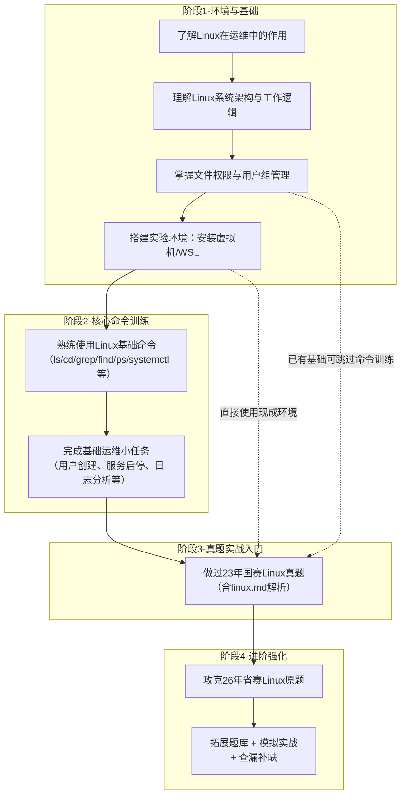

> [!Tip]  
> 首次阅读请浏览[学习过程表](#学习过程)清楚要学习的内容  

# 正式学习
首次学习linux,推荐先阅读[菜鸟教程](https://www.runoob.com/linux/linux-tutorial.html),了解linux的作用 用法 要用linux的原因.  
然后看一看[linux的目录结构](https://www.runoob.com/linux/linux-system-contents.html)linux是由哪几个结构组成的,明白linux一切皆文件的道理,  
最后看[文件权限](https://www.runoob.com/linux/linux-file-attr-permission.html)和[目录相关](https://www.runoob.com/linux/linux-file-content-manage.html)的.  
熟悉相关知识后,开始学习如何在linux中做各种操作,这里要边看边练,不懂的问ai直接贴个报错和问题  
例:  
  

> [!TIP]
> 问了AI之后要在虚拟机里做实验加深记忆.  

提到虚拟机,这里可以使用cockpit自带的[web虚拟机控制台](https://192.168.31.245:9090/=192.168.31.245/machines);   
这里推荐使用戴尔服务器的[IDRC](https://192.168.31.246/)在里面使用kvm管理器  //新建虚拟机和编辑虚拟机的参数,因为这样可以更改更具体的配置    
使用IDRC创建虚拟机教程: [KVM-manager创建虚拟机](images/bandicam%202026-04-20%2021-39-21-641.mp4)  
使用cockpit创建虚拟机教程: [cockpit创建虚拟机](images/bandicam%202026-04-20%2021-42-21-893.mp4)  
> [!attention]  
> 打好基础后,跟着[linux](linux.md)这篇教程做赛题熟悉做题流程  

> [!TIP]
> 掌握做题的方法,试着自己解决各种报错,可以使用`systemctl status 服务名`
> 或者`journalctl -u 服务名 --no-pager -n 50`   
> 看服务报错 ,实在不行就贴报错给ai看  

---
### 服务的笔记:

[做题准备](linux.md#做题准备)  --[视频](http://192.168.31.245:8989/crazybaby/linux_video/-/raw/main/%E5%81%9A%E9%A2%98%E5%87%86%E5%A4%87.mp4?ref_type=heads)   
[NTP服务](linux.md#2利用chrony配置linux1为其他linux主机提供ntp服务)  --[视频](http://192.168.31.245:8989/crazybaby/linux_video/-/raw/main/chrony%E6%9C%8D%E5%8A%A1.mp4?ref_type=heads)_先做**DNS**服务和**SSH**服务再做该服务_ 1↩︎
[SSH服务](linux.md#3所有linux主机之间包含本主机root用户实现密钥ssh认证禁用密码认证) --[视频](http://192.168.31.245:8989/crazybaby/linux_video/-/raw/main/SSH%E6%9C%8D%E5%8A%A1.mp4?ref_type=heads)_先做**DNS**服务,做的过程中生成公钥_  
[DNS服务](linux.md#4利用bind配置linux1为主dns服务器linux2为备用dns服务器为所有linux主机提供冗余dns正反向解析服务) --[视频](http://192.168.31.245:8989/crazybaby/linux_video/-/raw/main/DNS%E6%9C%8D%E5%8A%A1.mp4?ref_type=heads)   <-- (The first!!!)  
[CA服务](linux.md#做法二) --[视频]()  

1: 比赛中的ip会自动获取,要把ip转化成主机名给dns解析
> [!TIP]  
> 视频最好下载下来看(视频都在内网的gitlab上,外网无法访问)    

---   
> [!note]  
>    如何使用[git](git.md)  
>    如何使用[vim](vim.md)
# 学习过程:  

