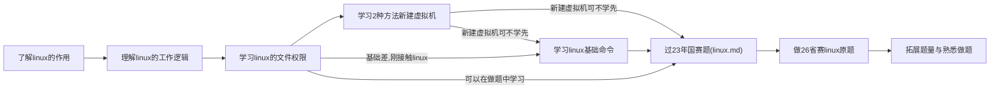

# 学习过程:  

首次学习linux,推荐先阅读[菜鸟教程](https://www.runoob.com/linux/linux-tutorial.html),了解linux的作用 用法 要用linux的原因.  
然后看一看[linux的目录结构](https://www.runoob.com/linux/linux-system-contents.html)linux是由哪几个结构组成的,明白linux一切皆文件的道理,  
最后看[文件权限](https://www.runoob.com/linux/linux-file-attr-permission.html)和[目录相关](https://www.runoob.com/linux/linux-file-content-manage.html)的.  
熟悉相关知识后,开始学习如何在linux中做各种操作,这里要边看边练,不懂的问ai直接贴个报错和问题  
例:  
  

> [!TIP]
> 问了之后要在虚拟机里做实验加深记忆.  

提到虚拟机,这里可以使用cockpit自带的[web虚拟机控制台](https://192.168.31.245:9090);   
这里更加推荐使用戴尔服务器的[IDRC](https://192.168.31.246/)在里面使用kvm管理器  
新建虚拟机和编辑虚拟机的参数,因为这样可以更改更具体的配置    
使用IDRC创建虚拟机教程: [KVM-manager创建虚拟机](images/bandicam%202026-04-20%2021-39-21-641.mp4)  
使用cockpit创建虚拟机教程: [cockpit创建虚拟机](images/bandicam%202026-04-20%2021-42-21-893.mp4)  
> [!important]
> 打好基础后,跟着[linux](linux.md)这篇教程做赛题熟悉做题流程  

> [!TIP]
> 掌握做题的方法,试着自己解决各种报错,可以使用`systemctl status 服务名`
> 或者`journalctl -u 服务名 --no-pager -n 50`   
> 看服务报错 ,实在不行就贴报错给ai看  

### 关于服务的笔记:
[做题准备](linux.md#做题准备)             --[视频](http://192.168.31.245:8989/crazybaby/linux_video/-/raw/main/%E5%81%9A%E9%A2%98%E5%87%86%E5%A4%87.mp4?ref_type=heads)视频最好下载下来看    
[NTP服务](linux.md#2利用chrony配置linux1为其他linux主机提供ntp服务)  --[视频]()_先做ssh和DNS服务再做该服务[^1]_

[SSH服务](linux.md#3所有linux主机之间包含本主机root用户实现密钥ssh认证禁用密码认证) --[视频]()  
[DNS服务](linux.md#4利用bind配置linux1为主dns服务器linux2为备用dns服务器为所有linux主机提供冗余dns正反向解析服务) --[视频]()   
[CA服务](http://192.168.31.245:8989/crazybaby/note/-/blob/main/linux_note/linux.md?ref_type=heads#5%E9%85%8D%E7%BD%AElinux1%E4%B8%BAca%E6%9C%8D%E5%8A%A1%E5%99%A8%E4%B8%BAlinux%E4%B8%BB%E6%9C%BA%E9%A2%81%E5%8F%91%E8%AF%81%E4%B9%A6%E8%AF%81%E4%B9%A6%E9%A2%81%E5%8F%91%E6%9C%BA%E6%9E%84%E6%9C%89%E6%95%88%E6%9C%9F10%E5%B9%B4%E5%85%AC%E7%94%A8%E5%90%8D%E4%B8%BAlinux1skillslan%E7%94%B3%E8%AF%B7%E5%B9%B6%E9%A2%81%E5%8F%91%E4%B8%80%E5%BC%A0%E4%BE%9Blinux%E6%9C%8D%E5%8A%A1%E5%99%A8%E4%BD%BF%E7%94%A8%E7%9A%84%E8%AF%81%E4%B9%A6%E8%AF%81%E4%B9%A6%E4%BF%A1%E6%81%AF%E6%9C%89%E6%95%88%E6%9C%9F5%E5%B9%B4%E5%85%AC%E7%94%A8%E5%90%8Dskillslan%E5%9B%BD%E5%AE%B6cn%E7%9C%81beijing%E5%9F%8E%E5%B8%82beijing%E7%BB%84%E7%BB%87skills%E7%BB%84%E7%BB%87%E5%8D%95%E4%BD%8Dsystem%E4%BD%BF%E7%94%A8%E8%80%85%E5%8F%AF%E9%80%89%E5%90%8D%E7%A7%B0skillslan%E5%92%8Cskillslan%E5%B0%86%E8%AF%81%E4%B9%A6skillscrt%E5%92%8C%E7%A7%81%E9%92%A5skillskey%E5%A4%8D%E5%88%B6%E5%88%B0%E9%9C%80%E8%A6%81%E8%AF%81%E4%B9%A6%E7%9A%84linux%E6%9C%8D%E5%8A%A1%E5%99%A8etcssl%E7%9B%AE%E5%BD%95%E6%B5%8F%E8%A7%88%E5%99%A8%E8%AE%BF%E9%97%AEhttps%E7%BD%91%E7%AB%99%E6%97%B6%E4%B8%8D%E5%87%BA%E7%8E%B0%E8%AF%81%E4%B9%A6%E8%AD%A6%E5%91%8A%E4%BF%A1%E6%81%AF)

[^1]:比赛中的ip会自动获取,要把ip转化成主机名给dns解析