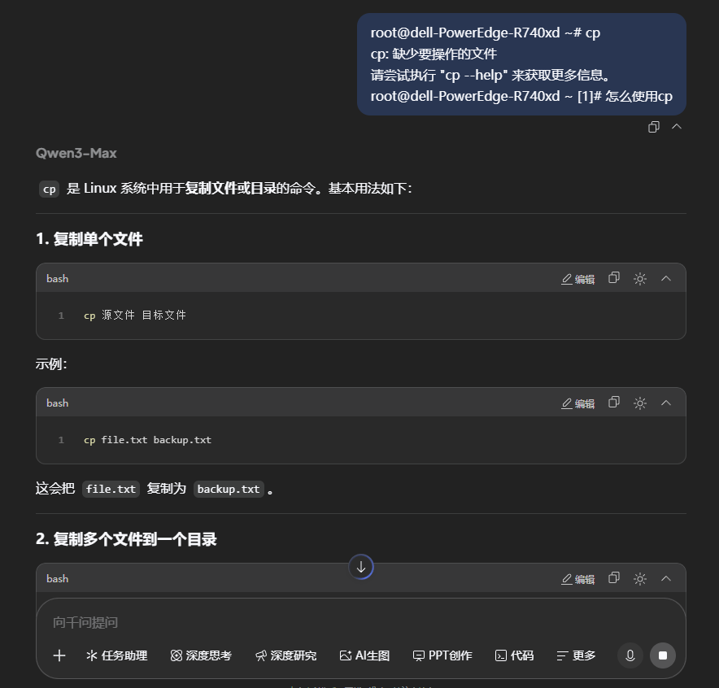
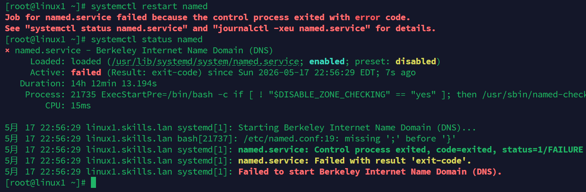
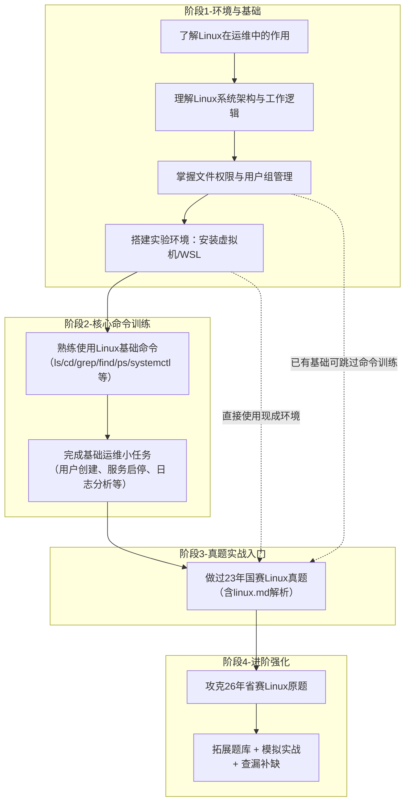

> [!Tip]  
> 首次阅读请浏览[学习过程表](#学习过程)清楚要学习的内容  
> **导航:**  
> [服务的笔记](#服务的笔记)  

# 初次学习
首次学习linux,推荐先阅读[菜鸟教程(外网)](https://www.runoob.com/linux/linux-tutorial.html)[(内网)](http://192.168.31.245:8083/linux-tutorial.html),了解linux的作用 用法 要用linux的原因.  
然后看一看[linux的目录结构(外网)](https://www.runoob.com/linux/linux-system-contents.html)[(内网)](http://192.168.31.245:8083/linux-system-contents.html)linux是由哪几个结构组成的,明白linux一切皆文件的道理,  
最后看[文件权限(外网)](https://www.runoob.com/linux/linux-file-attr-permission.html)[(内网)](http://192.168.31.245:8083/linux-file-attr-permission.html)和[目录相关(外网)](https://www.runoob.com/linux/linux-file-content-manage.html)[(内网)](http://192.168.31.245:8083/linux-file-content-manage.html)的.  

---

## 虚拟机:  
这里可以使用cockpit自带的[web虚拟机控制台](https://192.168.31.245:9090/=192.168.31.245/machines);   
这里推荐使用戴尔服务器的[IDRC](https://192.168.31.246/)在里面使用kvm管理器  //新建虚拟机和编辑虚拟机的参数,因为这样可以更改更具体的配置    
使用IDRC创建虚拟机教程: [KVM-manager创建虚拟机](images/bandicam%202026-04-20%2021-39-21-641.mp4)  
使用cockpit创建虚拟机教程: [cockpit创建虚拟机](images/bandicam%202026-04-20%2021-42-21-893.mp4)  

---
# 正式学习  

阅读[基础](基础.md)! 学习linux的基本操作,明白后续做题的意思

熟悉相关知识后,开始学习如何在linux中做各种操作,  
这里要边看边练,不懂的问ai直接贴个报错和问题  

例:  
  

> [!TIP]
> 问了AI之后要在虚拟机里做实验加深记忆   

打好基础后,跟着[linux](linux.md)这篇笔记做赛题熟悉做题流程;  
这篇是23年国赛题,算是简单的题目  

> [!TIP]
> 掌握做题的方法,试着自己解决各种报错,可以使用`systemctl status 服务名`  
> 或者`journalctl -u 服务名 --no-pager -n 50` 查看服务的状态 知道哪里错误再去修改最后重启服务,实在不会就贴报错给ai看  
> 例:   
> 这里19th line出现错误,在花括号结束前缺失分号,我们需要编辑配置文件  
> 修改完毕使用 `systemctl restart named`重启服务载入配置

---
## 服务的笔记:
> **23国赛:**  
> [做题准备](linux.md#做题准备)  --[视频](http://192.168.31.245:8989/wlyw/linux_video/-/raw/main/23%E5%9B%BD%E8%B5%9B/%E5%81%9A%E9%A2%98%E5%87%86%E5%A4%87.mp4?ref_type=heads)    
> [NTP服务](linux.md#ntp服务)  --[视频](http://192.168.31.245:8989/wlyw/linux_video/-/raw/main/23%E5%9B%BD%E8%B5%9B/chrony%E6%9C%8D%E5%8A%A1.mp4?ref_type=heads)_先做**DNS**服务和**SSH**服务再做该服务_ 1↩︎  
> [SSH服务](linux.md#ssh服务) --[视频](http://192.168.31.245:8989/wlyw/linux_video/-/raw/main/23%E5%9B%BD%E8%B5%9B/SSH%E6%9C%8D%E5%8A%A1.mp4?ref_type=heads)_先做**DNS**服务,做的过程中生成公钥_    <--(The second!!!)  
> [DNS服务](linux.md#dns服务) --[视频](http://192.168.31.245:8989/wlyw/linux_video/-/raw/main/23%E5%9B%BD%E8%B5%9B/DNS%E6%9C%8D%E5%8A%A1.mp4?ref_type=heads)   <-- (The first!!!)   
> [CA服务](linux.md#ca服务) --[视频](http://192.168.31.245:8989/wlyw/linux_video/-/raw/main/23%E5%9B%BD%E8%B5%9B/CA%E6%9C%8D%E5%8A%A1.mp4?ref_type=heads)  
> [ansible服务](linux.md#ansible服务) --[视频](http://192.168.31.245:8989/wlyw/linux_video/-/raw/main/23%E5%9B%BD%E8%B5%9B/ansible%E6%9C%8D%E5%8A%A1.mp4?ref_type=heads) <-- 做了ssh密钥前提  
> [apache服务](linux.md#apache服务) --[视频](http://192.168.31.245:8989/wlyw/linux_video/-/raw/main/23%E5%9B%BD%E8%B5%9B/apache%E6%9C%8D%E5%8A%A1.mp4?ref_type=heads)  
> [tomcat服务](linux.md#tomcat服务) --[视频]()  
> [samba服务](linux.md#samba服务) --[视频]()  
> [nfs服务端](linux.md#nfs服务端) --[视频]()  
> [nfs客户端](linux.md#nfs客户端) --[视频]()  
> [ftp服务](linux.md#ftp服务) --[视频]()  
> [iscsi服务](linux.md#iscsi服务) --[视频]()  
> [mysql服务](linux.md#mysql服务) --[视频]()  
> [mariadb服务](linux.md#mariadb服务) --[视频]()  
> [shell脚本](linux.md#shell脚本) --[视频]()  

> **26样题:**  
> [NTP服务](26样题.md#ntp服务)  --[视频]()_先做**DNS**服务和**SSH**服务再做该服务_ 1↩︎  
> [SSH服务](26样题.md#ssh服务) --[视频]()_先做**DNS**服务,做的过程中生成公钥_    <--(The second!!!)  
> [DNS服务](26样题.md#dns服务) --[视频]()   <-- (The first!!!)   
> [CA服务](26样题.md#ca服务) --[视频]()  
> [ansible服务](26样题.md#ansible服务) --[视频]() <-- 做了ssh密钥前提  
> [tomcat服务](26样题.md#tomcat服务) --[视频]()  
> [keepalived服务](26样题.md#keepalived服务) --[视频]()  
> [iscsi服务](26样题.md#iscsi服务) --[视频]()  
> [redis服务](26样题.md#redis服务) --[视频]()  
> [邮件服务](26样题.md#邮件服务) --[视频]()  
> [mariadb服务](26样题.md#mariadb服务) --[视频]()  
> [mysql服务](26样题.md#mysql服务) --[视频]()  
> [mariadb服务](26样题.md#mariadb服务) --[视频]()  
> [shell脚本](26样题.md#shell脚本) --[视频]()  

1: 比赛中的ip会自动获取,要把ip转化成主机名给dns解析
> [!TIP]  
> 视频最好下载下来看,或使用火狐内核的浏览器如"Zen"(视频都在内网的gitlab上,外网无法访问)    

---   
> [!note]  
> **拓展知识:**  
>    如何使用[git](git.md)  
>    如何使用[vim](vim.md)
# 学习过程:  

```mermaid
graph TB
    subgraph 阶段1-环境与基础
        A["了解Linux在运维中的作用"] --> B["理解Linux系统架构与工作逻辑"]
        B --> C["掌握文件权限与用户组管理"]
        C --> Env["搭建实验环境：安装虚拟机/WSL"]
    end

    subgraph 阶段2-核心命令训练
        Env --> E["熟练使用Linux基础命令<br/>（ls/cd/grep/find/ps/systemctl等）"]
        E --> P["完成基础运维小任务<br/>（用户创建、服务启停、日志分析等）"]
    end

    subgraph 阶段3-真题实战入门
        P --> F["做过23年国赛Linux真题<br/>（含linux.md解析）"]
        C -.->|已有基础可跳过命令训练| F
        Env -.->|直接使用现成环境| F
    end

    subgraph 阶段4-进阶强化
        F --> G["攻克26年省赛Linux原题"]
        G --> H["拓展题库 + 模拟实战 
        + 查漏补缺"]
    end
```

