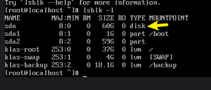

> [!NOTE]
> [视频](http://192.168.31.245:8989/wlyw/linux_video/-/raw/main/%E5%88%9B%E5%BB%BA%E4%B8%80%E4%B8%AA%E7%B3%BB%E7%BB%9Fqcow2%E7%A3%81%E7%9B%98.mp4?ref_type=heads)  

> [!tip]  
> windows 的qcow2也是原理  

使用控制台新建虚拟机,选择需要的安装的系统iso文件  
编辑系统所需的配置,不要太大以免爆内存,vcpu.  
root@dell-PowerEdge-R740xd /d/iso#  `cd /var/lib/libvirt/images/`  
//切换到kvm默认存放的路径,完成安装.  
_要进去系统完成最基本的配置和把镜像导进去_  
root@dell-PowerEdge-R740xd /v/l/l/images# `virt-sparsify --compress kylin-test.qcow2 kylin--competition.qcow2`  
// 给磁盘瘦身
[   0.0] Create overlay file in /tmp to protect source disk  
[   0.1] Examine source disk  
 100%   ⟦▒▒▒▒▒▒▒▒▒▒▒▒▒▒▒▒▒▒▒▒▒▒▒▒▒▒▒▒▒▒▒▒▒▒▒▒▒▒▒▒▒▒▒▒▒▒▒▒▒▒▒▒▒▒▒▒▒▒▒▒▒▒▒▒▒▒▒▒▒▒▒▒▒▒▒▒▒▒▒▒▒▒▒▒▒▒▒▒▒▒▒▒▒▒▒▒▒▒▒⟧ --:--  
[   7.0] Fill free space in /dev/klas/backup with zero  
 100%   ⟦▒▒▒▒▒▒▒▒▒▒▒▒▒▒▒▒▒▒▒▒▒▒▒▒▒▒▒▒▒▒▒▒▒▒▒▒▒▒▒▒▒▒▒▒▒▒▒▒▒▒▒▒▒▒▒▒▒▒▒▒▒▒▒▒▒▒▒▒▒▒▒▒▒▒▒▒▒▒▒▒▒▒▒▒▒▒▒▒▒▒▒▒▒▒▒▒▒▒▒⟧ 00:00  
[  26.9] Fill free space in /dev/klas/root with zero  
 100%   ⟦▒▒▒▒▒▒▒▒▒▒▒▒▒▒▒▒▒▒▒▒▒▒▒▒▒▒▒▒▒▒▒▒▒▒▒▒▒▒▒▒▒▒▒▒▒▒▒▒▒▒▒▒▒▒▒▒▒▒▒▒▒▒▒▒▒▒▒▒▒▒▒▒▒▒▒▒▒▒▒▒▒▒▒▒▒▒▒▒▒▒▒▒▒▒▒▒▒▒▒⟧ 00:00  
[ 235.2] Clearing Linux swap on /dev/klas/swap  
 100%   ⟦▒▒▒▒▒▒▒▒▒▒▒▒▒▒▒▒▒▒▒▒▒▒▒▒▒▒▒▒▒▒▒▒▒▒▒▒▒▒▒▒▒▒▒▒▒▒▒▒▒▒▒▒▒▒▒▒▒▒▒▒▒▒▒▒▒▒▒▒▒▒▒▒▒▒▒▒▒▒▒▒▒▒▒▒▒▒▒▒▒▒▒▒▒▒▒▒▒▒▒⟧ 00:00  
[ 241.7] Fill free space in /dev/sda1 with zero  
[ 243.6] Copy to destination and make sparse  
[ 968.3] Sparsify operation completed with no errors.  
virt-sparsify: Before deleting the old disk, carefully check that the   
target disk boots and works correctly.  
  
瘦身完也是有60G的空间的  
后面选择桥接网卡后,就可以使用克隆来新建其他主机  